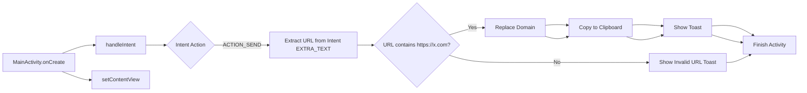

# x2vx for Android
Converting URL starts from `x.com` to `vxtwitter.com` via Sharing Intent to copy to clipboard without tracking links.

 

## for iOS

  

## Diagram

```mermaid
graph LR
    A[MainActivity.onCreate] --> B[handleIntent]
    A --> C[setContentView]
    B --> D{Intent Action}
    

    F[Replace Domain]
    F --> G[Copy to Clipboard]
    G --> H[Show Toast]
    H --> I[Finish Activity]
    
    D -->|ACTION_SEND| J[Extract URL from Intent EXTRA_TEXT]
    J --> K{URL contains https://x.com?}
    K -->|Yes| F[Replace Domain]
    K -->|No| L[Show Invalid URL Toast]
    F --> G[Copy to Clipboard]
    G --> H[Show Toast]
    H --> I
    L --> I
```
